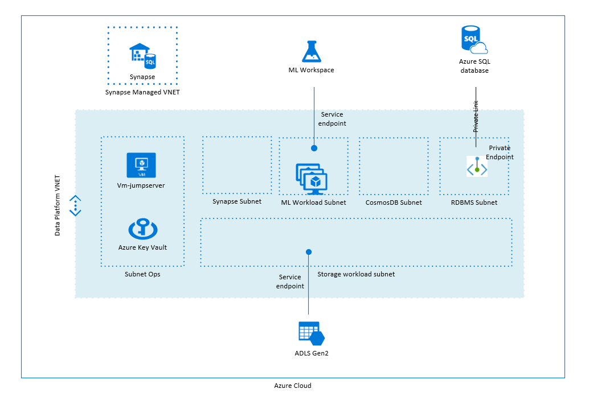

# Introduction to data analytics landing zone starter

Welcome to Cloud Adoption Framework for Azure: Terraform landing zones.

This landing zone is a starter for data analytics platform that stacks on top of **landingzone_caf_foundations**.

### Data analytics landing zone foundation


### Blueprints & Modules
| Examples | Description|
|----------|------------|
|blueprint_datalake | Create datalake account |
|blueprint_synapse | Synapse analytics workspace |
|blueprint_aml | Machine Learning workspace for auto ml |
|module_azure_storage | Re-usable module to create the storage account |

## Prerequisites

This landing zone is a "level 2" type of landing zone, which requires you have set the foundations. The supported lower level landing zone is "landingzone_caf_foundations" which can be found in the same release and must have been applied successfully before applying this one.

## Getting Started

To deploy a landing zone, use the execution environnement as described at the root of the landing zone repository.

## Deploying this landing zone

```hcl
rover /tf/caf/landingzones/landingzone_data_analytics plan
```

Review the configuration and if you are ok with it, deploy it by running:

```hcl
rover /tf/caf/landingzones/landingzone_starter apply
```

Have fun playing with the landing zone an once you are done, you can simply delete the deployment using:

```hcl
rover /tf/caf/landingzones/landingzone_starter destroy
```

## Contribute

Pull requests are welcome to evolve the framework and integrate new features.
